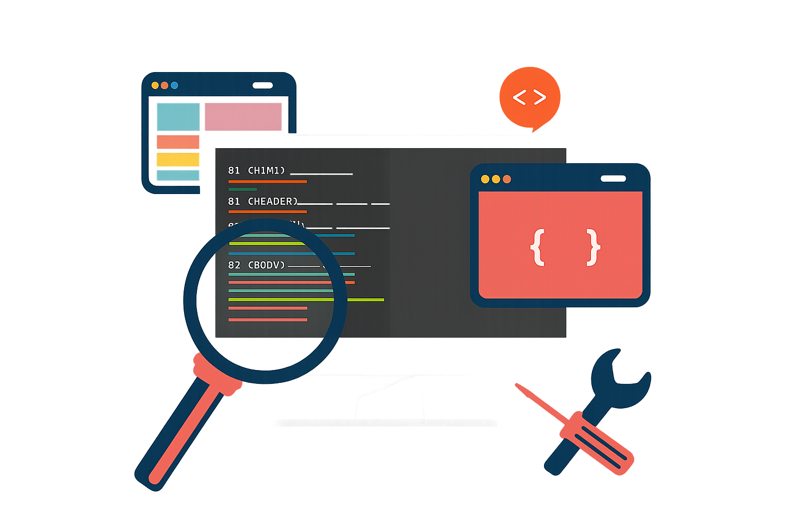

<h1 align="center" style="color: lightblue;">Hello guys! I'm João Dias 👋</h1>

<table>
  <tr>
    <td valign="top" align="center" width="70%">
      
<b>💻 My top languages</b>

      
      
      
      
      
      

      
<b>🧰 My top tools</b>

      
      
      
      
      
      

      
<b>📬 Contact me</b>

      
      
    </td>
    <td align="center" width="30%">
      
    </td>
  </tr>
</table>
